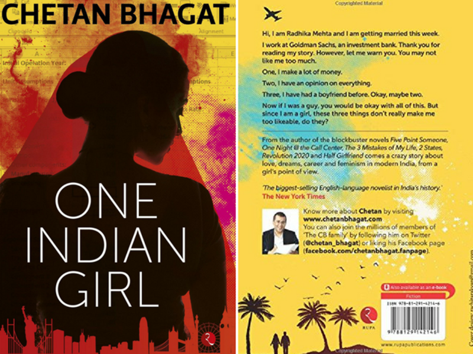

<!-- Place this tag in your head or just before your close body tag. -->

<!-- Place this tag in your head or just before your close body tag. -->

<h1>Spoiler Alert!</h1> 

The latest from the famous author Chetan Bhagat, the one I liked the most out of his too-filmy pieces is definitely the "One Indian Girl". Radhika 
Mehta, one of the VPs of the Goldman Sachs earns more than enough to digest. Being from a traditional Punjabi family, her parents want her to get 
married but the bohemian culture of the west, her live-in X relationships, past affairs and high dreams of a modern girl did not allow 
her to **accept** things the way her parents wanted.  

In my eyes, she portrays a rebel. Many a time, Radhika compares her wheatish skin tone to her sister's whiter complexion and throws 
hilarious comments. To her mother, she was a defective piece who doesn't want to get married rather too **educated** to get married. However,
the huge money-mountain, grown at her back only made her stay upright. She was geeky, infamous for her studious nature still her X and Y found
her attractive. Ultimately her life gets tangled with twists and turns and *"Men"* and at present, she is trapped in the wildest corner of her mind.

 <!-- no responses yet -->

 <!-- no response yet -->

 <!-- no response yet -->

<!-- so taking a chance to have a direct link -->

Okay, so you know, she is a rigid woman, a woman with a lot of money, a job in the US and is filled with self-respect. But well, I found
her character to be *too woman-ish* at times, which shows she did care about feelings. There is a logical fight, a fight between the
concept of working men and working women. At times, the story loses its flow when more men come and complicate the relationship agenda.
Further, author's approach towards the intimate scenes was obnoxious, I did get a flavor of erotica. Still, I mostly liked the story. 

At the end, I wished her to really get settled after the huge commotion at the wedding scene. In fact, I thought the author would already
be getting worked up with so many psychological fragments. But he chose a unique ending, a riskier option but the best suited to deal with
Radhika's heart. Sincerely, I loved the ending, it was the only thing that was realistic yet it had **the effect**. I won't go into
the details anymore as I have already told a lot but would like to say that, in fact, we all **do** have an inner voice which
helps when you get into trouble. The sad part is that, we choose to ignore it which Radhika didn't. I am sure, *Mr. Chetan Bhagat* has already
done a decent business with this and yup, just like his other pieces this would soon be converted into a film. 

<!-- Place this tag where you want the button to render. -->
<a class="github-button" href="https://github.com/DarkDem/DarkDem.github.io" data-icon="octicon-star" data-style="mega" data-count-href="/DarkDem/DarkDem.github.io/stargazers" data-count-api="/repos/DarkDem/DarkDem.github.io#stargazers_count" data-count-aria-label="# stargazers on GitHub" aria-label="Star DarkDem/DarkDem.github.io on GitHub">Star</a>
<a href="https://twitter.com/share" class="twitter-share-button" data-show-count="false">Tweet</a>
<!-- Place this tag where you want the share button to render. -->

